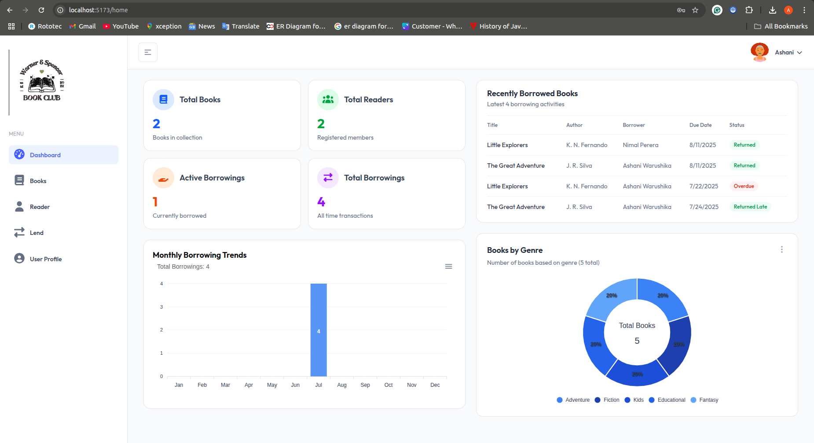
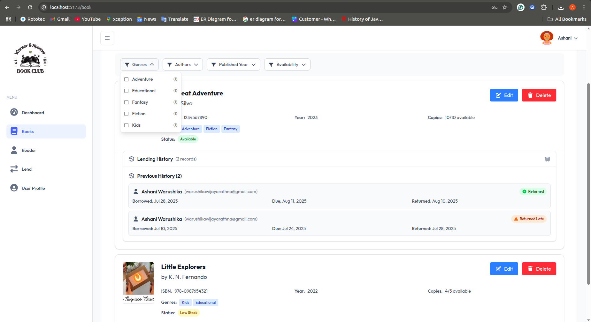
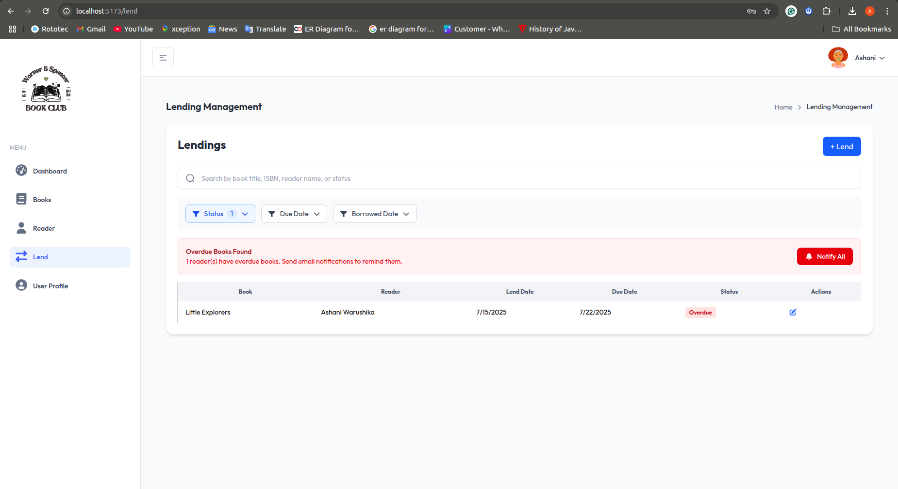
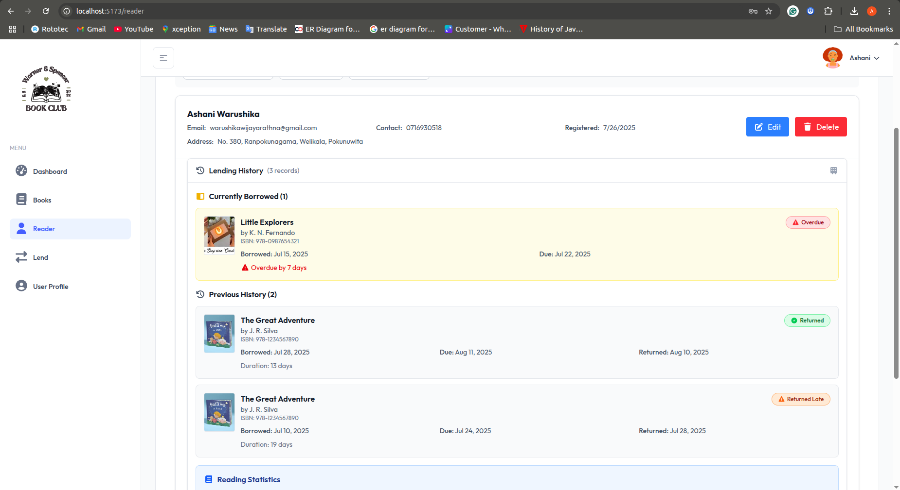
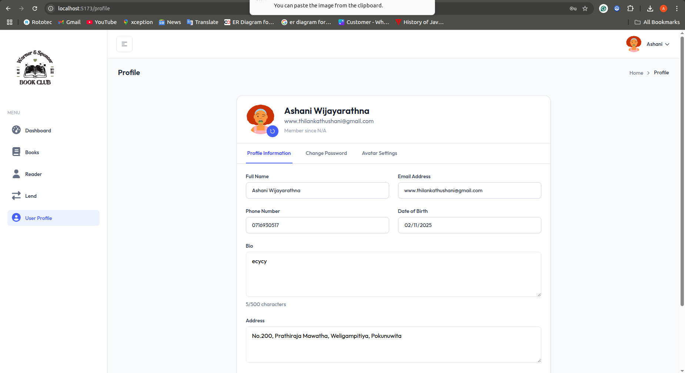

# Book Management System

A comprehensive full-stack book management system built with React, TypeScript, Node.js, and MongoDB. This application provides complete library management functionality including book cataloging, user management, lending operations, and administrative features.

## 🚀 Features

### 📚 Book Management
- Add, edit, and delete books
- Track book availability and copies
- Search and filter functionality
- ISBN-based book identification
- Genre categorization
- Book cover image support

### 👥 User Management
- User authentication and authorization
- Role-based access control (Admin/Librarian/Member)
- User profiles and preferences
- Reader registration and management

### 📋 Lending System
- Book borrowing and returning
- Due date tracking
- Overdue notifications
- Lending history and audit logs

### 📊 Dashboard & Analytics
- Real-time statistics and metrics
- Visual charts and reports
- Inventory tracking
- User activity monitoring

### 🔔 Notifications
- Email notifications for due dates
- Overdue book alerts
- System notifications

## 🖼️ Screenshots

Here are some screenshots showcasing the key features of the Book Management System:

### Dashboard

*Main dashboard with real-time statistics, charts, and system overview*

### Book Management

*Book catalog with search, filter, and CRUD operations*

### Lending System

*Lending management interface for borrowing and returning books*

### Reader Management

*Reader registration and management interface*

### User Profile

*User profile management and settings*

## 🛠️ Tech Stack

### Frontend
- **React 19** - UI library
- **TypeScript** - Type safety
- **Vite** - Build tool and dev server
- **Tailwind CSS** - Styling framework
- **React Router** - Client-side routing
- **Axios** - HTTP client
- **React Hot Toast** - Notifications
- **ApexCharts** - Data visualization
- **FullCalendar** - Calendar functionality

### Backend
- **Node.js** - Runtime environment
- **Express.js** - Web framework
- **TypeScript** - Type safety
- **MongoDB** - Database
- **Mongoose** - ODM for MongoDB
- **JWT** - Authentication
- **bcrypt** - Password hashing
- **Nodemailer** - Email handling

## 📋 Prerequisites

Before running this application, make sure you have the following installed:

- Node.js (v18 or higher)
- npm or yarn
- MongoDB
- Git

## 💾 Database Setup

This project uses MongoDB as the database. The `database/book-club/` directory contains sample JSON files that can be imported into your MongoDB instance:

- `bookclub.auditlogs.json` - Audit logs for tracking system activities
- `bookclub.books.json` - Sample book records
- `bookclub.lendings.json` - Lending transaction records
- `bookclub.readers.json` - Reader/member information
- `bookclub.users.json` - User accounts and authentication data

### Importing Sample Data (Optional)

To import the sample data into your MongoDB database:

```bash
# Navigate to the database directory
cd database/book-club

# Import each collection (replace 'book-management' with your database name)
mongoimport --db book-management --collection auditlogs --file bookclub.auditlogs.json --jsonArray
mongoimport --db book-management --collection books --file bookclub.books.json --jsonArray
mongoimport --db book-management --collection lendings --file bookclub.lendings.json --jsonArray
mongoimport --db book-management --collection readers --file bookclub.readers.json --jsonArray
mongoimport --db book-management --collection users --file bookclub.users.json --jsonArray
```

**Note:** Ensure your MongoDB service is running before importing the data.

## ⚡ Quick Start

### 1. Clone the repository
```bash
git clone https://github.com/Warushika-Wijayarathna/book-management-system-(react).git
cd book-management-system-(react)
```

### 2. Backend Setup
```bash
cd backend
npm install
```

Create a `.env` file in the backend directory:
```env
PORT=5000
MONGODB_URI=mongodb://localhost:27017/book-management
JWT_SECRET=your-jwt-secret-key
EMAIL_FROM=your-email@domain.com
```

Start the backend server:
```bash
npm run dev
```

### 3. Frontend Setup
```bash
cd frontend
npm install
```

Create a `.env` file in the frontend directory:
```env
VITE_API_URL=http://localhost:5000/api
```

Start the frontend development server:
```bash
npm run dev
```

### 4. Access the Application
- Frontend: `http://localhost:5173`
- Backend API: `http://localhost:5000`

## 📁 Project Structure

```
book-management-system-(react)/
├── backend/                    # Backend API server
│   ├── src/
│   │   ├── controllers/        # Route controllers
│   │   │   ├── audit.controller.ts
│   │   │   ├── auth.controller.ts
│   │   │   ├── book.controller.ts
│   │   │   ├── dashboard.controller.ts
│   │   │   ├── lending.controller.ts
│   │   │   ├── notification.controller.ts
│   │   │   ├── overdue.controller.ts
│   │   │   ├── reader.controller.ts
│   │   │   └── user.controller.ts
│   │   ├── models/            # MongoDB models
│   │   │   ├── AuditLog.ts
│   │   │   ├── Book.ts
│   │   │   ├── Lending.ts
│   │   │   ├── Reader.ts
│   │   │   └── User.ts
│   │   ├── routes/            # API routes
│   │   │   ├── audit.routes.ts
│   │   │   ├── auth.routes.ts
│   │   │   ├── book.routes.ts
│   │   │   ├── dashboard.routes.ts
│   │   │   ├── lending.routes.ts
│   │   │   ├── notification.routes.ts
│   │   │   ├── overdue.routes.ts
│   │   │   ├── reader.routes.ts
│   │   │   ├── user.routes.ts
│   │   │   └── index.ts
│   │   ├── middlewares/       # Custom middlewares
│   │   │   ├── authenticateToken.ts
│   │   │   └── errorHandler.ts
│   │   ├── services/          # Business logic services
│   │   │   ├── auditLogger.ts
│   │   │   └── emailService.ts
│   │   ├── db/               # Database configuration
│   │   │   └── mongo.ts
│   │   ├── errors/           # Error handling
│   │   │   └── APIError.ts
│   │   └── app.ts            # Main application file
│   ├── package.json
│   ├── tsconfig.json
│   └── nodemon.json
├── frontend/                   # React frontend
│   ├── src/
│   │   ├── components/        # Reusable UI components
│   │   │   ├── auth/         # Authentication components
│   │   │   ├── common/       # Common UI components
│   │   │   ├── filters/      # Filter components
│   │   │   ├── form/         # Form components
│   │   │   ├── header/       # Header components
│   │   │   ├── homeStatistic/ # Statistics components
│   │   │   ├── tables/       # Table components
│   │   │   ├── ui/           # Basic UI components
│   │   │   └── UserProfile/  # User profile components
│   │   ├── pages/            # Application pages
│   │   │   ├── AuthPages/    # Authentication pages
│   │   │   ├── Dashboard/    # Dashboard pages
│   │   │   ├── OtherPage/    # Other pages
│   │   │   ├── BookPage.tsx
│   │   │   ├── LendPage.tsx
│   │   │   ├── ReaderPage.tsx
│   │   │   └── UserProfiles.tsx
│   │   ├── context/          # React context providers
│   │   │   ├── AuthContext.tsx
│   │   │   ├── AuthProvider.tsx
│   │   │   ├── ModalContext.tsx
│   │   │   ├── SidebarContext.tsx
│   │   │   └── useAuth.tsx
│   │   ├── hooks/            # Custom React hooks
│   │   │   ├── useGoBack.ts
│   │   │   ├── useModal.ts
│   │   │   └── usePrompt.ts
│   │   ├── services/         # API service functions
│   │   ├── types/            # TypeScript type definitions
│   │   ├── layout/           # Layout components
│   │   ├── icons/            # SVG icons and assets
│   │   ├── App.tsx           # Main App component
│   │   ├── main.tsx          # Application entry point
│   │   ├── router.tsx        # Application routing
│   │   ├── index.css         # Global styles
│   │   ├── svg.d.ts          # SVG type definitions
│   │   └── vite-env.d.ts     # Vite environment types
│   ├── public/               # Static assets
│   │   ├── images/           # Image assets
│   │   │   ├── logo/         # Logo files
│   │   │   └── favicon.ico
│   │   └── favicon.png
│   ├── package.json
│   ├── vite.config.ts
│   ├── tsconfig.json
│   ├── tsconfig.app.json
│   ├── tsconfig.node.json
│   ├── postcss.config.js
│   └── index.html
├── database/                   # Database files
│   └── book-club/             # MongoDB JSON exports
│       ├── bookclub.auditlogs.json
│       ├── bookclub.books.json
│       ├── bookclub.lendings.json
│       ├── bookclub.readers.json
│       └── bookclub.users.json
├── screenshots/                # Application screenshots
│   ├── book.png               # Book management interface
│   ├── dashboard.png          # Main dashboard view
│   ├── lending.png            # Lending system interface
│   ├── profile.png            # User profile page
│   └── reader.png             # Reader management page
└── README.md
```

## 🔧 Available Scripts

### Backend
- `npm run dev` - Start development server with nodemon
- `npm run build` - Build TypeScript to JavaScript
- `npm start` - Start production server

### Frontend
- `npm run dev` - Start development server
- `npm run build` - Build for production
- `npm run preview` - Preview production build
- `npm run lint` - Run ESLint

## 🌟 Key Features Explained

### Authentication System
- JWT-based authentication
- Secure password hashing with bcrypt
- Role-based access control
- Session management with cookies

### Book Catalog
- Complete CRUD operations for books
- ISBN validation and uniqueness
- Genre-based categorization
- Inventory tracking (total vs available copies)
- Image upload and management

### Lending Management
- Borrowing and return workflows
- Due date calculations
- Overdue tracking and notifications
- Comprehensive lending history
- Audit logging for all transactions

### Dashboard Analytics
- Real-time statistics
- Interactive charts and graphs
- Inventory reports
- User activity metrics

## 🤝 Contributing

Contributions are welcome! Please follow these steps:

1. Fork the repository
2. Create a feature branch (`git checkout -b feature/YourFeature`)
3. Commit your changes (`git commit -m 'Add some feature'`)
4. Push to the branch (`git push origin feature/YourFeature`)
5. Open a Pull Request

## 📄 License

This project is licensed under the [MIT License](LICENSE).

## 👨‍💻 Author

**Warushika Wijayarathna**
- GitHub: [@Warushika-Wijayarathna](https://github.com/Warushika-Wijayarathna)

## 🙏 Acknowledgments

- Thanks to all contributors who helped build this project
- Special thanks to the open-source community for the amazing tools and libraries

---

*For detailed API documentation, please refer to the backend documentation or contact the maintainer.*
